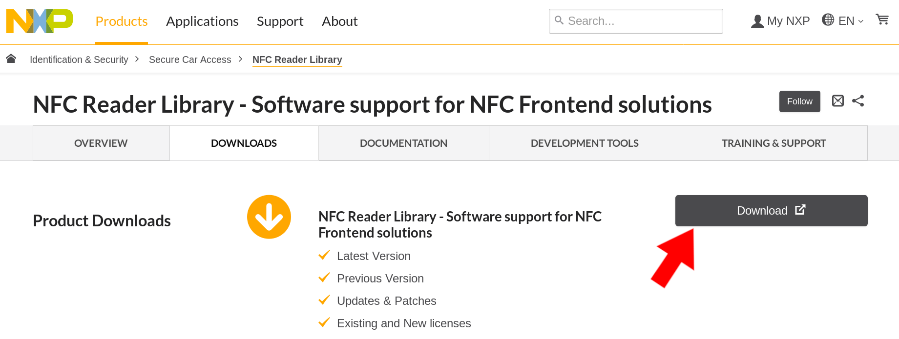
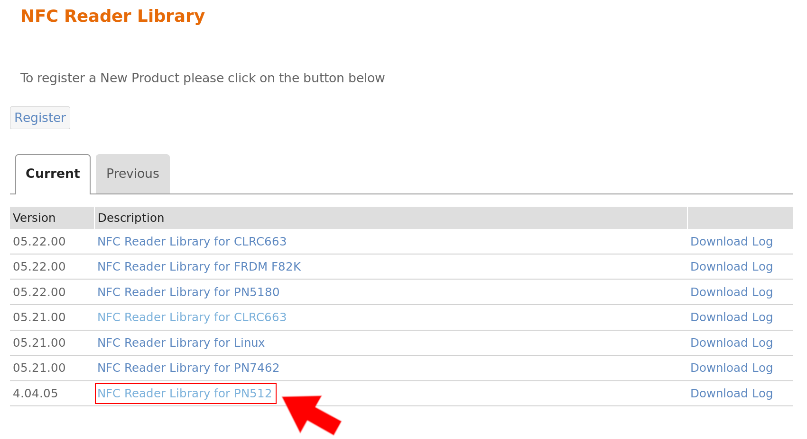
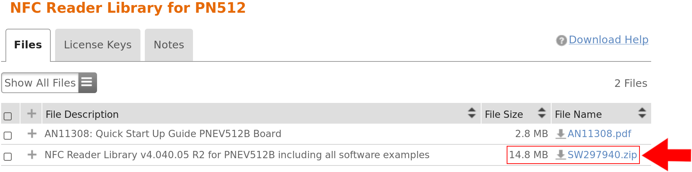

# MATRIX HAL NFC (WIP)

matrix-hal-nfc is a simple, easy to use wrapper for using NXP's NFC Reader Library with the PN512 chip on the [MATRIX Creator](https://matrix-io.github.io/matrix-documentation/matrix-creator/overview/).


## Roadmap
- [x] Reading Info (All tags)
- [x] Reading (MIFARE Ultralight & NTAG)
- [x] Writing (MIFARE Ultralight & NTAG)
- [ ] Improve installation & usage

# Prerequisites
Before moving on, be sure to have 
[setup](https://matrix-io.github.io/matrix-documentation/matrix-creator/device-setup/) a MATRIX Creator with 
[MATRIX HAL](https://matrix-io.github.io/matrix-documentation/matrix-hal/getting-started/installation-package/) 
installed (HAL is needed for LEDs & matrix-creator-init).

Download the following packages to your Raspberry Pi.
```
sudo apt install cmake git
```


## Download The NXP Library
> Due to NXP's terms & conditions, we cannot directly distribute the library to our users.

You can download the **NFC Reader Library for PN512** by creating an account on the NXP website and downloading the zip file [**here**](https://www.nxp.com/products/identification-security/secure-car-access/nfc-reader-library-software-support-for-nfc-frontend-solutions:NFC-READER-LIBRARY?tab=In-Depth_Tab#nogo).


Click the download button.



Click the `4.04.05 NFC Reader Library for PN512`.



Then click `SW297940.zip` to download `NFC Reader Library v4.040.05 R2 for PNEV512B including all software examples`.



## Install MATRIX HAL NXP

To start installing the NXP library, clone this repository.

```
git clone https://github.com/matrix-io/matrix-hal-nfc.git
```

Now move the `SW297940.zip` file you downloaded into the matrix-hal-nfc folder. If you don't know how to transfer files into your Raspberry Pi, follow this [simple guide on using an FTP client](https://www.techmuzz.com/how-to/raspberrypi/transfer-files-raspberry-pi-computer/).

Once complete, you can apply our MATRIX Creator config patch and install the library into `/usr/local/include/matrix_nfc/nxp_nfc` with the following commands:

```
unzip SW297940.zip -d nxp_nfc && patch < creator_nfc_pins.patch ./nxp_nfc/NxpNfcRdLib/intfs/phPlatform_Port_Pi_RC523.h && sudo mkdir -p /usr/local/include/matrix_nfc/nxp_nfc/ && sudo cp -r nxp_nfc/ /usr/local/include/matrix_nfc/ && sudo chmod 755 -R /usr/local/include/matrix_nfc/ && sudo rm -r nxp_nfc
```

Inside matrix-hal-nxp, you need to run the build script to finish the library installation. This will install the header files in `/usr/local/include/matrix_nfc/` and the libmatrix_hal_nfc.so library file in `/usr/local/lib/`.

```
./build.sh
```

## Running The NFC Examples

After building is complete, a few compiled examples will be in the `build/examples` folder.

You can compile your own programs by using:
```
g++ -o YOU_OUTPUT YOUR_INPUT -std=c++11 -DNXPBUILD__PH_RASPBERRY_PI -I/usr/local/include/matrix_nfc/nxp_nfc/NxpNfcRdLib/types -I/usr/local/include/matrix_nfc/nxp_nfc/NxpNfcRdLib/intfs -lmatrix_hal_nfc -lmatrix_creator_hal
```
